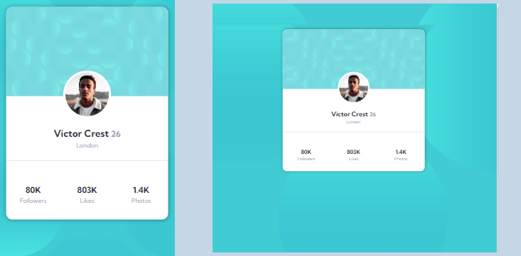

# Frontend Mentor - Huddle landing page with single introductory section solution

This is a solution to the [Huddle landing page with single introductory section challenge on Frontend Mentor](https://www.frontendmentor.io/challenges/huddle-landing-page-with-a-single-introductory-section-B_2Wvxgi0). Frontend Mentor challenges help you improve your coding skills by building realistic projects. 

## Table of contents

- [Overview](#overview)
  - [Screenshot](#screenshot)
  - [Links](#links)
- [My process](#my-process)
  - [Built with](#built-with)
  - [What I learned](#what-i-learned)
  - [Continued development](#continued-development)
  - [Useful resources](#useful-resources)
- [Author](#author)
- [Acknowledgments](#acknowledgments)

**Note: Delete this note and update the table of contents based on what sections you keep.**

## Overview

### Screenshot



### Links

- Solution URL: (https://github.com/Junbol-Frontend-Mentor/profile-card-component)
- Live Site URL: (https://junbol-frontend-mentor.github.io/profile-card-component/)

## My process

### Built with

- Semantic HTML5 markup
- CSS custom properties
- Sass(SCSS)
- BEM (Block.Element.Modifier)
- Flexbox
- Mobile-first workflow
- GIT/GitHub
- PowerShell (CLI)

### What I learned

Working with SCSS Grid & MediaQueries

```
.container {
  flex: 1 0 auto;

  margin: 0 auto; /* This centers the container horizontally */
}


 &:hover {
      // Correct hover syntax using &
      transform: rotate(360deg); /* Completes a full circle */
    }
Sass(SCSS)  +   BEM (Block.Element.Modifier)

```

### Continued development

I would like to continue studying responsive SCSS specially with Grid + Flexbox and CSS animation, transitions and FX like parallax.

### Useful resources

- [web.dev](https://web.dev/learn/css) - This helped me for get back on track with CSS.
- [w3schools](https://www.w3schools.com/css/default.asp) - The one place to refresh stuff in practical way.

## Author

- Website - [Junier Bolivar](https://www.bolivarcreativedesign.com)
- Frontend Mentor - [Junbol](https://www.frontendmentor.io/profile/Junbol)
- Twitter - [@JunierBolivar](https://www.twitter.com/@JunierBolivar)

## Acknowledgments
